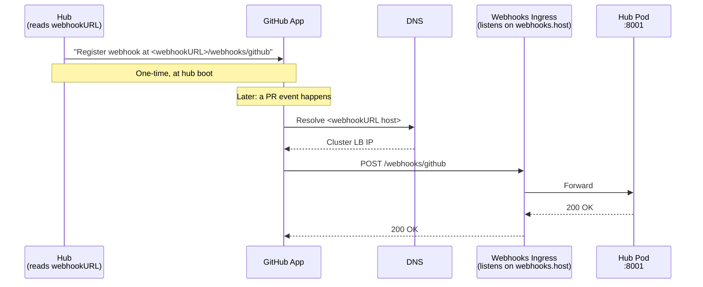

# Lunar Helm Charts

Helm charts for deploying [Earthly Lunar](https://earthly.dev/earthly-lunar) on Kubernetes.

## Prerequisites

- Kubernetes 1.29+
- Helm 3.x
- PostgreSQL 16+ (external — not included in the chart)
- S3-compatible object storage (two buckets: logs and resources)
- A GitHub App installed on your organization — the fastest path to create one is [our manifest script](https://github.com/earthly/lunar/blob/main/scripts/create-github-app.sh) (browser-based flow, prints the credentials you'll need below)

## Installing

```bash
helm repo add earthly https://earthly.github.io/charts
helm repo update

helm install lunar earthly/lunar \
  --namespace lunar --create-namespace \
  -f values.yaml
```

Before the command above will succeed, create the [required secrets](#required-secrets) and set the [required values](#required-values).

### Required secrets

The chart requires three user-managed secrets up front: the database credentials, the GitHub App private key, and the Hub licence JWT. Three other secrets (the hub auth token, the GitHub webhook secret, and — when enabled — the Grafana admin credentials) are auto-generated by the chart on install with a random value, persisted as Kubernetes Secrets with `helm.sh/resource-policy: keep`, and re-read from the cluster on subsequent upgrades. To bring your own instead of the auto-generated value, set the `secretName` field on the corresponding values key — the chart will reference your secret and skip auto-generation. See the **GitOps note** below if you use ArgoCD or Flux.

```bash
# Database credentials (always user-managed)
kubectl -n lunar create secret generic lunar-db \
  --from-literal=username='<db-user>' \
  --from-literal=password='<db-password>'

# GitHub App private key (always user-managed).
# The hub base64-decodes this value internally, so the secret must contain the
# base64-encoded PEM (not the raw PEM). The one-liner below works on both
# GNU and BSD/macOS base64.
kubectl -n lunar create secret generic lunar-github-app \
  --from-literal=private-key="$(base64 < path/to/private-key.pem | tr -d '\n')"

# Hub licence JWT (always user-managed).
kubectl -n lunar create secret generic lunar-hub-licence \
  --from-literal=hub-licence.jwt='<signed-licence-jwt>'
```

After install, retrieve any chart-managed secret with:

```bash
# Hub auth token (pass to CLI / CI agents as LUNAR_HUB_TOKEN)
kubectl -n lunar get secret lunar-auth-token \
  -o jsonpath='{.data.token}' | base64 -d

# GitHub webhook secret (register with your GitHub App)
kubectl -n lunar get secret lunar-github-webhook \
  -o jsonpath='{.data.webhook-secret}' | base64 -d
```

(Adjust `lunar-...` for your release name; the actual names are `<release>-auth-token`, `<release>-github-webhook`, `<release>-grafana-admin`.)

#### GitOps note

Helm's `lookup` function — used by the chart to persist auto-generated secrets across upgrades — returns empty during client-side template rendering. ArgoCD and Flux render Helm charts client-side by default, which means without a workaround they would regenerate the random values on every reconciliation and detect continuous drift.

Two options if you use GitOps:

1. **Bring-your-own-secrets** — set `hub.auth.secretName`, `hub.github.webhookSecret.secretName`, and `grafana.admin.secretName` to secrets you manage with External Secrets Operator, Sealed Secrets, Vault, etc. The chart will reference them and skip auto-generation entirely.
2. **Tell your GitOps tool to ignore the generated fields** — example for ArgoCD:

   ```yaml
   ignoreDifferences:
     - kind: Secret
       jsonPointers:
         - /data/token
         - /data/webhook-secret
         - /data/password
   ```

### Required values

Minimum `values.yaml` that has to be provided — everything else has a sensible default.

```yaml
hub:
  licence:
    secretName: "lunar-hub-licence"
    secretKey: "hub-licence.jwt"

  db:
    name: lunar
    host: your-db-host.example.com

  s3:
    logsBucket: your-lunar-logs-bucket
    resourcesBucket: your-lunar-resources-bucket

  github:
    app:
      id: 123456
      installId: 78901234
```

For GitHub webhook registration to work, the hub also needs an externally-reachable URL. The simplest path is to let the chart manage your ingress and set `hub.ingress.webhooks.host` — see [Ingress](#ingress) below. The hub uses `https://<webhooks.host>` automatically. If you front the hub yourself, set `hub.webhookURL` explicitly.

### GitHub authentication

Hub authenticates to GitHub as a GitHub App. Set `hub.github.app.id` + `hub.github.app.installId` and create the `lunar-github-app` secret holding the App's private-key PEM. The chart validates these at install time with `helm.sh/fail`.

### Object storage & AWS credentials

Lunar uses two S3-compatible buckets — one for streaming script logs, one for script resource archives fetched by init containers. Both must exist and be writable before pods start doing real work.

**AWS credentials are intentionally out of scope for this chart.** The hub uses the standard AWS SDK credential chain, so you can use whichever mechanism fits your cluster:

- **IRSA (recommended on EKS)** — annotate the chart's service account with the role ARN. The role needs `s3:GetObject` and `s3:PutObject` on both buckets.

  ```yaml
  serviceAccount:
    annotations:
      eks.amazonaws.com/role-arn: arn:aws:iam::123456789012:role/lunar-hub-s3
  hub:
    extraEnv:
      - name: AWS_REGION
        value: us-east-1
  ```

- **Explicit env vars** — inject credentials via `hub.extraEnv`, sourced from an existing secret:

  ```yaml
  hub:
    extraEnv:
      - name: AWS_REGION
        value: us-east-1
      - name: AWS_ACCESS_KEY_ID
        valueFrom:
          secretKeyRef: { name: lunar-aws, key: access-key-id }
      - name: AWS_SECRET_ACCESS_KEY
        valueFrom:
          secretKeyRef: { name: lunar-aws, key: secret-access-key }
  ```

Other providers (GKE Workload Identity, pod identity, IMDS, etc.) all work the same way — set whatever `AWS_*` or service-account plumbing you'd normally use for any AWS-SDK workload. The chart does not create the buckets for you.

## Optional secrets

Only create these if you need the features they enable.

```bash
# Per-scope runtime secrets (only when the matching hub.secrets.*.secretName is set).
# The k8s secret's `secrets` data key is parsed by Hub as a comma-separated list
# of `NAME:VALUE` pairs (kelseyhightower/envconfig map format — NOT JSON). Each
# pair surfaces in script pods as `LUNAR_SECRET_<NAME>`.
# Most installs don't need these — prefer per-type script container spec envFrom /
# volumes (see operator.scriptContainerSpec*) for fine-grained control.
kubectl -n lunar create secret generic lunar-collector-secrets --from-literal=secrets='GH_TOKEN:ghp_xxx,NPM_TOKEN:npm_yyy'
kubectl -n lunar create secret generic lunar-cataloger-secrets --from-literal=secrets='GH_TOKEN:ghp_xxx'
kubectl -n lunar create secret generic lunar-policy-secrets    --from-literal=secrets='SLACK_WEBHOOK_URL:https://hooks.slack.com/services/...'

# Grafana admin (only if you set grafana.admin.secretName instead of letting
# the chart auto-generate; both username and password live in one secret)
kubectl -n lunar create secret generic my-grafana-admin \
  --from-literal=username='admin' \
  --from-literal=password='<your-grafana-password>'
```

## Ingress

The hub has two trust boundaries:

1. **Trusted API clients** — lunar CLI, CI agents, operator. Talk to hub over gRPC (port 8000) and HTTP (`/logs` on port 8001). Both use the same Hub auth token.
2. **GitHub webhooks** — public internet. POST to `/webhooks` on port 8001 only.

The chart renders separate ingresses for each, configured under two logical blocks: `hub.ingress.api` and `hub.ingress.webhooks`. You can put the API ingress on a private hostname (Tailscale, internal-DNS, VPN) and only expose webhooks to the public internet — or use the same hostname for both. Disable entirely (`hub.ingress.enabled: false`) if you front the hub with a LoadBalancer Service, a service mesh, or your own Ingress YAML.

**Single-host install** (same hostname serves both — fine for most setups):

```yaml
hub:
  ingress:
    enabled: true
    className: nginx
    tls:
      - secretName: lunar-tls
        hosts:
          - lunar.example.com
    annotations:
      cert-manager.io/cluster-issuer: letsencrypt
    api:
      host: lunar.example.com
    webhooks:
      host: lunar.example.com
```

**Split-host install** (API stays internal, webhooks ingress is the only public surface):

```yaml
hub:
  ingress:
    enabled: true
    className: nginx
    annotations:
      cert-manager.io/cluster-issuer: letsencrypt
    api:
      host: api.lunar.example.com
      tls:
        - secretName: lunar-api-tls
          hosts:
            - api.lunar.example.com
      annotations:
        # Restrict to an internal network range, for example.
        nginx.ingress.kubernetes.io/whitelist-source-range: "10.0.0.0/8"
    webhooks:
      host: webhooks.lunar.example.com
      tls:
        - secretName: lunar-webhooks-tls
          hosts:
            - webhooks.lunar.example.com
```

### Why `webhookURL` must match `webhooks.host`

When the hub boots, it reads `HUB_PUBLIC_BASE_URL` (the chart sets this from `hub.webhookURL`, which defaults to `https://<hub.ingress.webhooks.host>`) and registers `<webhookURL>/webhooks/github` with the GitHub App. GitHub then POSTs every webhook event to that URL, which must resolve to the webhooks ingress.



Three things must agree, or webhooks land in the void:

1. The hostname inside `hub.webhookURL` (derived from `webhooks.host` by default).
2. The DNS record for that hostname must resolve to your cluster's ingress.
3. An Ingress with a rule for that hostname and `/webhooks` path — which the chart creates for you when `hub.ingress.enabled: true`.

The chart enforces #1 internally: if you explicitly set `hub.webhookURL`, its host portion must equal `hub.ingress.webhooks.host`. Install fails fast if they disagree.

### What gets rendered

Three `Ingress` resources, all in the release namespace:

| Resource | Host | Path | Backend port |
|----------|------|------|--------------|
| `<release>-hub-api-grpc` | `api.host` | `/` | hub gRPC (8000) |
| `<release>-hub-api-http` | `api.host` | `/logs` | hub HTTP (8001) |
| `<release>-hub-webhooks` | `webhooks.host` | `/webhooks` | hub HTTP (8001) |

The `api-grpc` and `api-http` split exists because most ingress controllers apply `backend-protocol` annotations per-Ingress.

## Migrating from chart 1.x

The ingress shape changed in chart 2.0.0. `hub.publicBaseURL` was renamed to `hub.webhookURL` (and now defaults to `https://<webhooks.host>`). `hub.ingress.host` / `grpcAnnotations` / `httpAnnotations` moved under `hub.ingress.api.*` and `hub.ingress.webhooks.*`. The chart fails fast at install time when it sees the old shape.

```yaml
# Before (chart 1.x)
hub:
  publicBaseURL: "https://lunar.example.com"
  ingress:
    enabled: true
    host: lunar.example.com
    grpcAnnotations:
      nginx.ingress.kubernetes.io/backend-protocol: "GRPC"

# After (chart 2.0.0) — single-host
hub:
  # webhookURL is derived as "https://lunar.example.com" automatically.
  ingress:
    enabled: true
    api:
      host: lunar.example.com
      grpcAnnotations:
        nginx.ingress.kubernetes.io/backend-protocol: "GRPC"
    webhooks:
      host: lunar.example.com

# After (chart 2.0.0) — split-host (NEW capability)
hub:
  # webhookURL derived as "https://webhooks.lunar.example.com".
  ingress:
    enabled: true
    api:
      host: api.lunar.example.com
      grpcAnnotations:
        nginx.ingress.kubernetes.io/backend-protocol: "GRPC"
    webhooks:
      host: webhooks.lunar.example.com
```

## Post-install

### Load your configuration

Install and configure the [Lunar CLI](https://docs.lunar.build/install/cli) (needs `LUNAR_HUB_HOST` and `LUNAR_HUB_TOKEN` at minimum), then pull your primary configuration into the Hub:

```bash
lunar hub pull github://your-org/your-config-repo@main
```

### Webhooks

The Hub automatically registers per-repo GitHub webhooks at `<hub.webhookURL>/webhooks/github` when manifests are pulled. No manual webhook configuration is required as long as:

- `hub.webhookURL` resolves to your webhooks ingress and is reachable from GitHub. When chart-managed ingress is enabled, this is derived from `hub.ingress.webhooks.host` automatically.
- The GitHub App has the `repository_hooks: write` permission (the manifest script grants this by default).

## Upgrading

```bash
helm repo update

helm upgrade lunar earthly/lunar \
  --namespace lunar \
  -f values.yaml
```

## Uninstalling

```bash
helm uninstall lunar --namespace lunar
```

This removes all Kubernetes resources created by the chart. The PVC for hub state is **not** deleted automatically — remove it manually if you want to discard all data.

## Values reference

Run `helm show values earthly/lunar` for the full, authoritative list. Defaults below are grouped by component.

<details>
<summary><strong>Global</strong></summary>

| Key | Description | Default |
|-----|-------------|---------|
| `nameOverride` | Override the chart name | `""` |
| `fullnameOverride` | Override the full release name | `""` |
| `clusterDomain` | Kubernetes cluster DNS domain. Override only if your cluster was provisioned with a non-default `--cluster-domain` | `cluster.local` |
| `logging.level` | Log level (`debug`, `info`, `warn`, `error`) applied to both Hub and Operator | `info` |
| `logging.format` | Log format (`json` or `text`) applied to both Hub and Operator | `json` |
| `imagePullSecrets` | Image pull secrets for all pods | `[]` |
| `serviceAccount.create` | Create a service account | `true` |
| `serviceAccount.automount` | Automount the service account token | `true` |
| `serviceAccount.annotations` | Service account annotations (e.g. IAM role ARN) | `{}` |
| `serviceAccount.name` | Service account name (auto-generated if empty) | `""` |

</details>

<details>
<summary><strong>Hub</strong></summary>

The central gRPC/HTTP server. Stores metadata, evaluates policies, and serves the API.

**Image**

| Key | Description | Default |
|-----|-------------|---------|
| `hub.image.repository` | Hub container image | `ghcr.io/earthly/lunar-hub` |
| `hub.image.tag` | Image tag | `2.1.1` |
| `hub.image.pullPolicy` | Pull policy | `IfNotPresent` |
| `hub.maxWorkers.collect` | Max Hub workers for collector queue jobs; `0` means unlimited | `10` |
| `hub.maxWorkers.policy` | Max Hub workers for policy queue jobs; `0` means unlimited | `20` |
| `hub.maxWorkers.cronCollect` | Max Hub workers for cron collector queue jobs; `0` means unlimited | `5` |
| `hub.maxWorkers.cataloger` | Max Hub workers for cataloger queue jobs; `0` means unlimited | `1` |
| `hub.extraEnv` | Additional environment variables (`name`/`value` or `valueFrom` pairs) | `[]` |

**Public URL**

| Key | Description | Default |
|-----|-------------|---------|
| `hub.webhookURL` | External URL where GitHub posts webhooks. Chart registers `<webhookURL>/webhooks/github` with the GitHub App at boot. Defaults to `https://<hub.ingress.webhooks.host>` when chart-managed ingress is enabled. Set explicitly only when ingress is disabled (BYO) or you need a non-default scheme/port/path. | `""` (derived) |
| `hub.grafanaURLBase` | Base URL Hub uses for `[More Details]` links in PR comments. Resolution chain when empty: (1) `https://<grafana.ingress.hosts[0].host>` if chart-managed Grafana ingress; (2) `https://<hub.ingress.api.host>` if chart-managed Hub ingress (internal trust boundary, deliberately not the public webhooks host); (3) `hub.webhookURL` as BYO fallback. Override when Grafana lives on a hostname none of these capture. | `""` (derived) |

**Licence**

| Key | Description | Default |
|-----|-------------|---------|
| `hub.licence.secretName` | Secret containing the signed Hub licence JWT | `lunar-hub-licence` |
| `hub.licence.secretKey` | Key within the licence secret | `hub-licence.jwt` |
| `hub.licence.filePath` | In-container path used for `HUB_LICENCE_FILE` | `/var/run/secrets/lunar/hub-licence.jwt` |

**Database**

| Key | Description | Default |
|-----|-------------|---------|
| `hub.db.host` | PostgreSQL host | `""` **(required)** |
| `hub.db.name` | Database name | `""` **(required)** |
| `hub.db.port` | PostgreSQL port | `5432` |
| `hub.db.waitSecs` | Seconds to wait for DB readiness on startup | `45` |
| `hub.db.user.secretName` | Secret containing the DB username | `lunar-db` |
| `hub.db.user.secretKey` | Key within the secret | `username` |
| `hub.db.pass.secretName` | Secret containing the DB password | `lunar-db` |
| `hub.db.pass.secretKey` | Key within the secret | `password` |
| `hub.db.connectionOptions` | Extra options appended to the Postgres connection string (libpq KV format, space-separated). Default works against managed Postgres with forced TLS (RDS, Aurora, Cloud SQL); set to `"sslmode=disable"` for plain cluster-local Postgres. Also consumed by the operator. | `"sslmode=require"` |

> **Override footgun:** setting `hub.db.connectionOptions` **replaces** the whole string — the default is not merged in. If passing additional options (`connect_timeout`, `application_name`, etc.), include `sslmode=` yourself, space-separated:
> ```yaml
> # OK
> hub:
>   db:
>     connectionOptions: "sslmode=require connect_timeout=10"
> # BAD — silently drops sslmode=require
> hub:
>   db:
>     connectionOptions: "connect_timeout=10"
> ```

**GitHub**

Hub authenticates as a GitHub App. App ID, install ID, and the App's private-key secret are all required — the chart fails at install time otherwise. See [GitHub authentication](#github-authentication).

| Key | Description | Default |
|-----|-------------|---------|
| `hub.github.app.id` | GitHub App ID | `0` **(required)** |
| `hub.github.app.installId` | GitHub App Installation ID | `0` **(required)** |
| `hub.github.app.privateKey.secretName` | Secret containing the App private-key PEM | `lunar-github-app` |
| `hub.github.app.privateKey.secretKey` | Key within the secret | `private-key` |
| `hub.github.webhookSecret.secretName` | Secret containing the webhook secret | `lunar-github-webhook` |
| `hub.github.webhookSecret.secretKey` | Key within the secret | `webhook-secret` |
| `hub.github.baseUrl` | GitHub API base URL (for GitHub Enterprise Server) | `""` |
| `hub.github.syncWindow` | How far back to sync GitHub data on first pull | `2160h` (90 days) |

**S3 / Object Storage**

| Key | Description | Default |
|-----|-------------|---------|
| `hub.s3.logsBucket` | S3 bucket for log storage | `""` **(required)** |
| `hub.s3.resourcesBucket` | S3 bucket for script resources | `""` **(required)** |
| `hub.s3.logsUrlTtl` | Pre-signed URL TTL for script log uploads — Go [duration string](https://pkg.go.dev/time#ParseDuration) | `5m` |
| `hub.s3.resourcesUrlTtl` | Pre-signed URL TTL for script resource downloads (init-container fetch) | `1h` |

**Auth**

| Key | Description | Default |
|-----|-------------|---------|
| `hub.auth.secretName` | Secret containing the Hub auth token | `lunar-auth-token` |
| `hub.auth.secretKey` | Key within the secret | `token` |

**Script secrets (optional)**

Per-scope secrets the hub forwards to script execution. The K8s secret's `secrets` data key is a comma-separated list of `NAME:VALUE` pairs (envconfig map format, **not JSON**); each pair surfaces as `LUNAR_SECRET_<NAME>` in the script pod. Most installs don't need these — per-type container spec `envFrom` / `volumes` on `operator.scriptContainerSpec*` is usually a cleaner path. Leave `secretName` empty to skip injection entirely.

| Key | Description | Default |
|-----|-------------|---------|
| `hub.secrets.collector.secretName` | Collector secrets; empty disables | `""` |
| `hub.secrets.collector.secretKey` | Key within the secret | `secrets` |
| `hub.secrets.cataloger.secretName` | Cataloger secrets; empty disables | `""` |
| `hub.secrets.cataloger.secretKey` | Key within the secret | `secrets` |
| `hub.secrets.policy.secretName` | Policy secrets; empty disables | `""` |
| `hub.secrets.policy.secretKey` | Key within the secret | `secrets` |

**Logging**

Hub logging uses the top-level global `logging.*` values. Tenant and telemetry routing config is loaded from the signed licence JWT mounted via `hub.licence.*`.

**Policy queue**

| Key | Description | Default |
|-----|-------------|---------|
| `hub.policyQueue.pollInterval` | How often the queue is polled | `1s` |
| `hub.policyQueue.numWorkers` | Number of concurrent policy evaluation workers | `5` |

**Persistence**

The Hub uses a PVC for state, cached repos, and script code.

| Key | Description | Default |
|-----|-------------|---------|
| `hub.persistence.enabled` | Create a PVC for hub state | `true` |
| `hub.persistence.storageClass` | StorageClass (empty = cluster default) | `""` |
| `hub.persistence.size` | Volume size | `10Gi` |
| `hub.persistence.accessModes` | PVC access modes | `[ReadWriteOnce]` |

**Networking**

| Key | Description | Default |
|-----|-------------|---------|
| `hub.service.type` | Service type | `ClusterIP` |
| `hub.service.ports.server` | gRPC port | `8000` |
| `hub.service.ports.http` | HTTP port | `8001` |
| `hub.ingress.enabled` | Render the hub ingresses (three resources: api-grpc, api-http, webhooks) | `false` |
| `hub.ingress.className` | Shared default ingress class. Overridden per-block when set. | `""` |
| `hub.ingress.tls` | Shared default TLS config. Overridden per-block when set. | `[]` |
| `hub.ingress.annotations` | Shared default annotations applied to all three ingresses. | `{}` |
| `hub.ingress.api.host` | Hostname for the API ingress (gRPC + `/logs`). Required when enabled. | `""` |
| `hub.ingress.api.className` | Override `ingress.className` for the API ingress. | `""` |
| `hub.ingress.api.tls` | Override `ingress.tls` for the API ingress. | `[]` |
| `hub.ingress.api.annotations` | Annotations layered on top of `ingress.annotations` for both API sub-ingresses. | `{}` |
| `hub.ingress.api.grpcAnnotations` | Annotations applied only to the api-grpc Ingress (typically NGINX `backend-protocol: GRPC`). | NGINX `backend-protocol: GRPC` |
| `hub.ingress.api.httpAnnotations` | Annotations applied only to the api-http (`/logs`) Ingress. | `{}` |
| `hub.ingress.webhooks.host` | Hostname for the webhooks ingress (GitHub `/webhooks`). Required when enabled. Also the source of truth for derived `hub.webhookURL`. | `""` |
| `hub.ingress.webhooks.className` | Override `ingress.className` for the webhooks ingress. | `""` |
| `hub.ingress.webhooks.tls` | Override `ingress.tls` for the webhooks ingress. | `[]` |
| `hub.ingress.webhooks.annotations` | Annotations layered on top of `ingress.annotations` for the webhooks ingress. | `{}` |

**Probes**

| Key | Description | Default |
|-----|-------------|---------|
| `hub.readinessProbe.enabled` | Enable readiness probe | `true` |
| `hub.readinessProbe.initialDelaySeconds` | Delay before first check | `0` |
| `hub.readinessProbe.periodSeconds` | Check interval | `5` |
| `hub.readinessProbe.failureThreshold` | Failures before unready | `3` |
| `hub.livenessProbe.enabled` | Enable liveness probe | `true` |
| `hub.livenessProbe.initialDelaySeconds` | Delay before first check | `0` |
| `hub.livenessProbe.periodSeconds` | Check interval | `5` |
| `hub.livenessProbe.failureThreshold` | Failures before restart | `3` |

**Scheduling & pod spec**

| Key | Description | Default |
|-----|-------------|---------|
| `hub.resources` | CPU/memory requests and limits | `{}` |
| `hub.nodeSelector` | Node selector | `{}` |
| `hub.tolerations` | Tolerations | `[]` |
| `hub.affinity` | Affinity rules | `{}` |
| `hub.labels` | Additional deployment labels | `{}` |
| `hub.annotations` | Additional deployment annotations | `{}` |
| `hub.podLabels` | Additional pod labels | `{}` |
| `hub.podAnnotations` | Additional pod annotations | `{}` |
| `hub.podSecurityContext` | Pod security context | `{}` |
| `hub.securityContext` | Container security context | `{}` |
| `hub.volumeMounts` | Additional volume mounts | `[]` |
| `hub.volumes` | Additional volumes | `[]` |

</details>

<details>
<summary><strong>Operator</strong></summary>

Watches for script execution jobs and creates Kubernetes pods to run them.

**Images**

| Key | Description | Default |
|-----|-------------|---------|
| `operator.image.repository` | Operator image | `ghcr.io/earthly/lunar-snippet-operator` |
| `operator.image.tag` | Image tag | `2.1.1` |
| `operator.image.pullPolicy` | Pull policy | `IfNotPresent` |
| `operator.initImage.repository` | Init container image | `ghcr.io/earthly/lunar-snippet-init` |
| `operator.initImage.tag` | Image tag | `2.1.1` |
| `operator.sidecarImage.repository` | Sidecar container image | `ghcr.io/earthly/lunar-snippet-sidecar` |
| `operator.sidecarImage.tag` | Image tag | `2.1.1` |

**Behavior**

| Key | Description | Default |
|-----|-------------|---------|
| `operator.scriptNamespace` | Namespace for script pods (must exist if set) | `""` (release namespace) |
| `operator.hubHost` | Override hostname the operator and script pods use to reach Hub gRPC. Empty = computed in-cluster FQDN, which resolves cross-namespace. Set only for service-mesh / split-DNS / multi-cluster topologies | `""` |
| `operator.maxConcurrent` | Max concurrent script pods | `10` |
| `operator.healthPort` | Operator health check port | `8081` |
| `operator.extraEnv` | Additional environment variables | `[]` |

**Script pod configuration**

| Key | Description | Default |
|-----|-------------|---------|
| `operator.scriptContainerSpecPolicy` | Base container spec for policy script pods (resources, securityContext, env, etc.) | `{}` |
| `operator.scriptContainerSpecCollector` | Base container spec for collector script pods | `{}` |
| `operator.scriptContainerSpecCataloger` | Base container spec for cataloger script pods | `{}` |
| `operator.batchMaxCountPolicy` | Max jobs per policy pod; `0` uses the operator default | `0` |
| `operator.batchMaxCountCollector` | Max jobs per collector pod; `0` uses the operator default | `0` |
| `operator.batchMaxCountCataloger` | Max jobs per cataloger pod; `0` uses the operator default | `0` |
| `operator.scriptPodNodeSelector` | Node selector for script pods | `{}` |
| `operator.scriptPodTolerations` | Tolerations for script pods | `[]` |

**Logging**

Operator logging uses the top-level global `logging.*` values. Tenant and telemetry routing config is fetched at runtime from the Hub (`GetRuntimeConfig`).

**Scheduling & pod spec**

| Key | Description | Default |
|-----|-------------|---------|
| `operator.resources` | CPU/memory requests and limits | `{}` |
| `operator.nodeSelector` | Node selector | `{}` |
| `operator.tolerations` | Tolerations | `[]` |
| `operator.affinity` | Affinity rules | `{}` |
| `operator.podLabels` | Additional pod labels | `{}` |
| `operator.podAnnotations` | Additional pod annotations | `{}` |
| `operator.podSecurityContext` | Pod security context | `{}` |
| `operator.securityContext` | Container security context | `{}` |

</details>

<details>
<summary><strong>Grafana</strong></summary>

Pre-built Grafana instance with dashboards for policy results, component health, and collection activity. Deployed by default; set `grafana.enabled: false` to opt out.

| Key | Description | Default |
|-----|-------------|---------|
| `grafana.enabled` | Deploy the pre-built Grafana instance | `true` |
| `grafana.image.repository` | Grafana image | `ghcr.io/earthly/lunar-grafana` |
| `grafana.image.tag` | Image tag | `2.1.1` |
| `grafana.admin.secretName` | Secret containing both admin credentials. Empty = chart auto-generates `<release>-grafana-admin` (kept across uninstall) | `""` |
| `grafana.admin.userKey` | Key within the secret holding the username | `username` |
| `grafana.admin.passwordKey` | Key within the secret holding the password | `password` |
| `grafana.service.type` | Service type | `ClusterIP` |
| `grafana.service.port` | Service port | `80` |
| `grafana.ingress.*` | Same structure as `hub.ingress.*` | disabled |
| `grafana.extraEnv` | Additional environment variables | `[]` |
| `grafana.resources` | CPU/memory requests and limits | `{}` |
| `grafana.nodeSelector` | Node selector | `{}` |
| `grafana.tolerations` | Tolerations | `[]` |
| `grafana.affinity` | Affinity rules | `{}` |

</details>
